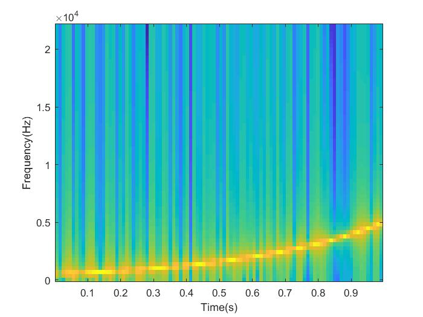
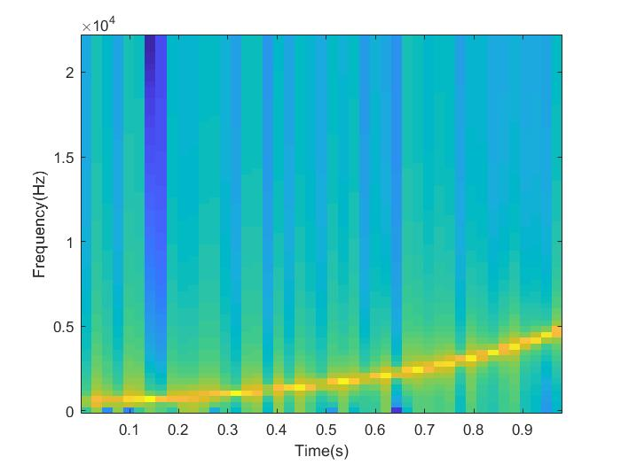
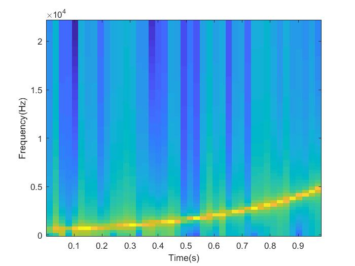
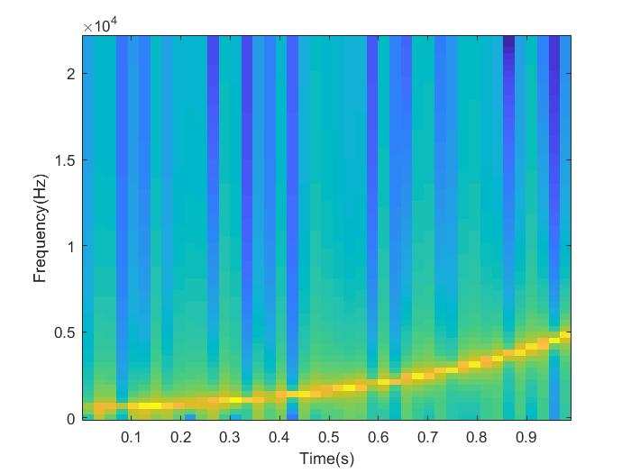
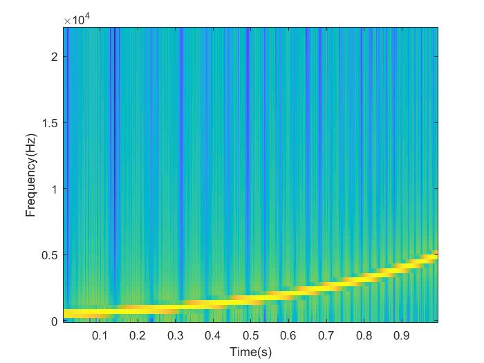
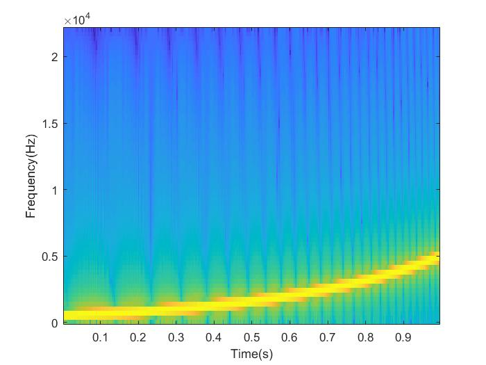
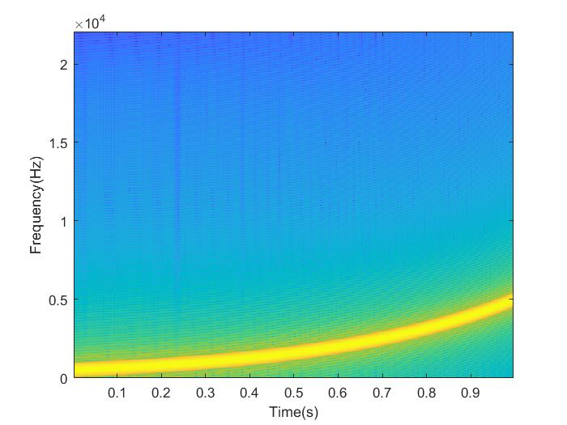
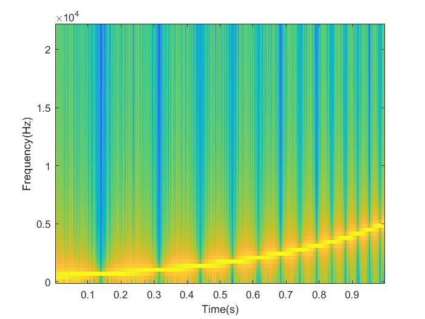

# Assignment 1
## Sine sweep generation

A sine sweep is generated using the function,

where,

*a* &rarr; *amplitude*
*f**s* &rarr; *sampling frequency*
*f* &rarr; *vector of logarithmically spaced frequency values*

The default parameters are,

*a* &rarr; *0.95*
*f**s*</scub> &rarr; *44.1kHz* 
*f* &rarr; *500Hz to 5000 Hz*

The *length* of the sine sweep is *1 second*.

The spectrogram of the sine sweep was generated using the parameters listed below using a custom function.

1.
*   window size = 128

    hop size = 64

    window type = rectangular

    fft length = 128

    

2.
*   window size = 256

    hop size = 64

    window type = rectangular

    fft length = 128

    

*   window size = 512

    hop size = 64

    window type = rectangular

    fft length = 128

    

*   window size = 1024

    hop size = 64

    window type = rectangular

    fft length = 128

    

3.
*   window size = 256

    hop size = 64

    window type = rectangular

    fft length = 256

    

*   window size = 256

    hop size = 16

    window type = rectangular

    fft length = 256

    

*   window size = 256

    hop size = 8

    window type = rectangular

    fft length = 256

    

4.
*   window size = 128

    hop size = 64

    window type = hamming

    fft length = 128

    

*   window size = 128

    hop size = 64

    window type = blackman

    fft length = 128

    

5.
*   window size = 256

    hop size = 64

    window type = rectangular

    fft length = 512

    

*   window size = 256

    hop size = 64

    window type = rectangular

    fft length = 1024

    

*   window size = 256

    hop size = 64

    window type = rectangular

    fft length = 2048

    

6. Parameters from 1 using MATLAB's *spectrogram* function.

    

## Inferences

Window size is inversely proportional to the time resolution. We can clearly see the vertical bands increase in size. We also know that time resolution and frequency resolution are inversely proportional. In the above images, we can see the thickness for each row of frequency is smaller as window size increases.

The higher frequencies are suppressed when using Blackman window when compared to Hamming Window. We can also observe less banding.

As the FFT Length increase, we can see the frequency distribution is much higher.