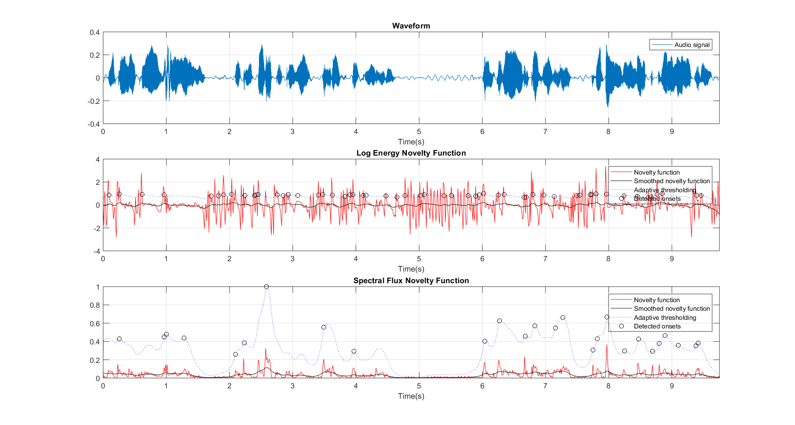
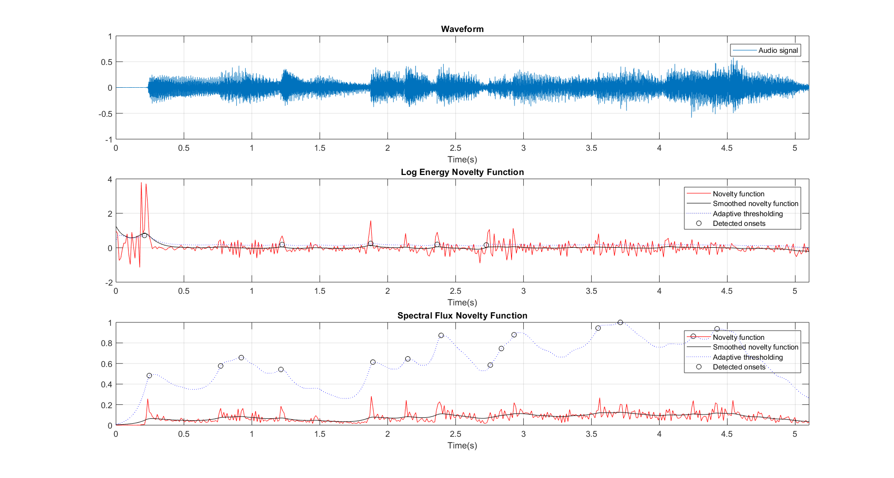
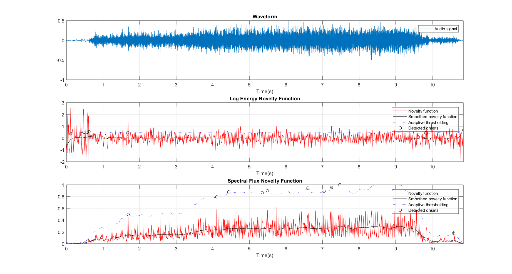

# Assignment 2
## Novelty Detection

Two novelty detection functions have been applied on different audio files to identify onsets in the audio.

The first novelty detection is the "Log Energy Derivative". It is a time domain based novelty function.

The second novelty detection is the "Rectified Spectral Flux". It is a frequency domain based novelty function.

Peak picking is performed on the novelty function to obtain the onsets. The following steps are performed as a part of the peak picking process.

1. Smoothing using a low-pass first-order Butterworth filter
2. Normalizing so that the maximum value is 1
3. Adaptive thresholding using the local median

The following parameters were used for the novelty function.

*Window size* = *1024*

*Hop size* = *512*

*Low-pass Butterworth filter frequency* = *4 Hz*

*Median filter length* = *8*

*Adaptive threshold offset* = *0.01*

### Results

#### Audio: Female Short

##### Characteristics of the audio:
The audio contains speech by a human or a synthesized voice very similar to a human’s voice. The audio contains many breaks. There are multiple sections where there is no voice and just noise in the audio clip. Because the audio is spoken by a female voice, it will tend more towards higher frequencies compared to a male voice. The ‘ssshh’ sounds in the audio also makes it get more high frequency components.

##### Characteristics of the novelty functions:
From the plot, we can see the Log Energy Novelty Function detects more number of peaks than the Spectral Flux Novelty Function. But, from comparing with the Waveform, we can see that some of the peaks from the Log Energy Novelty Function are false positives. In the areas where there is complete silence except for background noise, the Log Energy Novelty Function detects many peaks which are not actually peaks.

The Spectral Flux Novelty Function gives a better representation of the waveform and performs better when detecting peaks. The Adaptive thresholding function also works better on it.

#### Audio: Piano Debussy

##### Characteristics of the audio:
The audio contains a musical instrument playback. The sound includes a mix of high frequency and low frequency sounds. The audio is impulsive. We can also observe more sustain in the low frequency notes of the audio. The higher frequency notes are played at a faster speed.

##### Characteristics of the novelty functions:
The Log Energy Novelty Function gives very high energy where is no audio, which is at the starting of the audio clip. This is because of the derivative of the log function. We can try to minimize this by soft thresholding.

The Spectral Flux Novelty function is able to detect the onsets better. We can see the positions where 3 keys are pressed in quick succession in the Spectral Flux Novelty function. These peaks were not detected when using Log Energy Novelty function.

#### Audio: Sewing Machine Short

##### Characteristics of the audio:
The audio clip is a noisy sound. The sound of the sewing machine is stationary. The speed of the sewing machine is slow initially but ramps up slowly as it reaches the end of the audio clip where it is suddenly stopped.

##### Characteristics of the novelty functions:
As described for the above audio clip, the Log Energy Novelty function has large oscillations when there is no audio (at the start and very end). Because the change in energy is very less through out the audio clip, the log energy maintains consistent oscillations throughout.

The Spectral Flux Novelty function gives a better representation of the audio clip. We can see the energy start off very low initially and reach a higher value at the end. Also, we can notice the peak detection using Spectral Flux Novelty function works better. Because the sound is static, it is hard to determine if the peaks detected by the novelty functions are actually peaks or just false positives. We can observe the peaks detected in the Spectral Flux Novelty function at time instances where the speed of the sewing machine increases. These peaks are not found in the Log Energy Novelty function.

### Analysis of parameters

#### Window size:
Increase in window size decreases the resolution of the novelty function. Similarly, increase in hop size decreases the resolution and makes the novelty function more smooth. This in turn makes detection of novelty onsets harder.

#### Hop size:
If the hop size is reduced and made too small, the frequency resolution is very high which makes it very hard to detect peaks because there are less number of values per bin. This leads to detection of two peaks very close to each other. This might not be a peak at all but is detected as one which leads to false positives.

#### Low-pass Butterworth filter frequency:
A smaller lowpass Butterworth filter frequency smooths the novelty function more which makes it harder to find onsets. A larger value, makes the novelty function rough. But, this does not make it easier to detect onsets because it introduces too many peaks. The optimal lowpass Butterworth filter frequency needs to be obtained with a few trial and error iterations.

#### Median filter length:
A larger median filter length makes the adaptive thresholding smooth. This can increase the number of peaks detected and lead to false positives. If the median filter length is too small, this can make the adaptive thresholding filter too strict and no peaks can be detected because all the values are less than the threshold.

#### Adaptive threshold offset:
Increasing the offset allows us to detect fewer peaks and reducing offset allows us to detect more peaks. This is because the offset increases the overall value of all the threshold values obtained from the adaptive thresholding function.

### Finding better parameters:
The following parameters have been found to provide better results than the default parameters.

| Variables | Combination 1 | Combination 2 | Combination 3 |
| --------- | ------------- | ------------- | ------------- |
| Window size | 2056 | 1024 | 4096 |
| Hop size | 1024 | 640 | 1024 |
| Low-pass Butterworth filter frequency | 4 | 6 | 3 |
| Median filter length | 16 | 4 | 28 |
| Adaptive threshold offset | 0.03 | 0.01 | 0.00 |