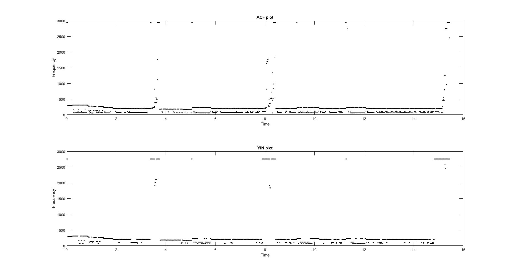
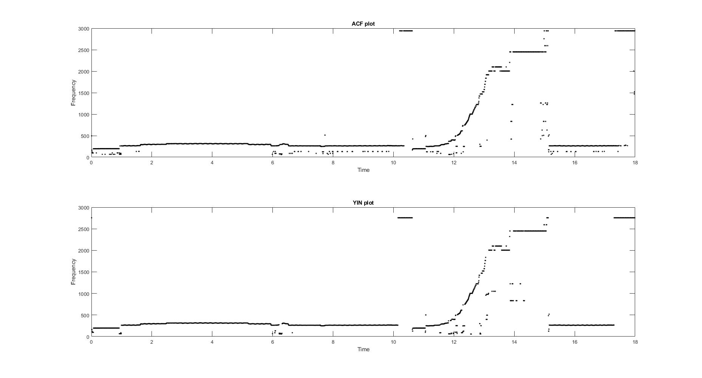
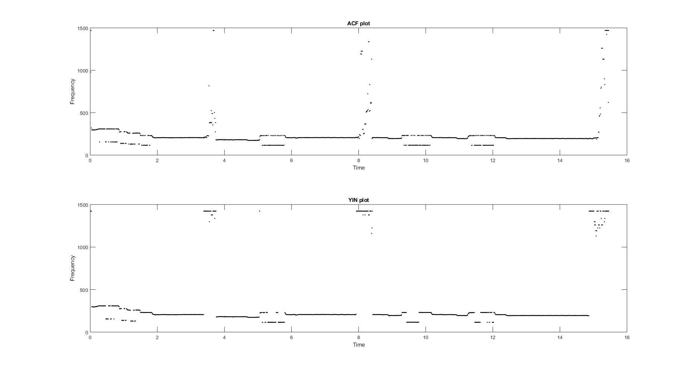
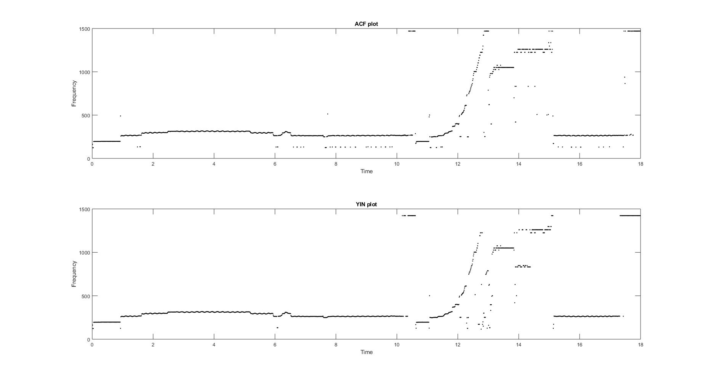

# Assignment 4

## Pitch Detection

The pitch of the audio file is estimated using two different methods.

##### 1. Short-term unbiased auto-correlation function

The estimated pitch is the one which maximizes the detection function within the specified range of lags.

##### 2. YIN

The estimated pitch is the one which minimizes the detection function within the specified range of lags.

The following parameters are used for pitch detection:

*Window size* = *2048*

*Hop size* = *256*

*Minimum lag* = *15*

*Maximum lag* = *800*

### Results

##### 1. Audio: jazz2REF

##### 2. Audio: T08-violin

### Inference

When comparing the ACF and YIN detection functions, we can clearly observe large octave error produced in ACF technique. While YIN does have octave error, it is significantly lesser than ACF. We can also see that, for silences in audio, ACF generates a lot of noise while YIN just gets a very high frequency value.

### Exploring parameters

*Window size* = *2048*

*Hop size* = *512*

*Minimum lag* = *30*

*Maximum lag* = *400*

##### 1. Audio: jazz2REF

##### 2. Audio: T08-violin

When using these parameters, we can observe the reduction in the noise of both the pitch detection functions. The octave error has been reduced and detected pitch is cleaner and easier to read. The small steps in the change of pitch value can also be observed easily than with the default parameters. With these new parameters, we can even observe the small modulation to the pitch of the violin sound which can be heard when playing the audio.